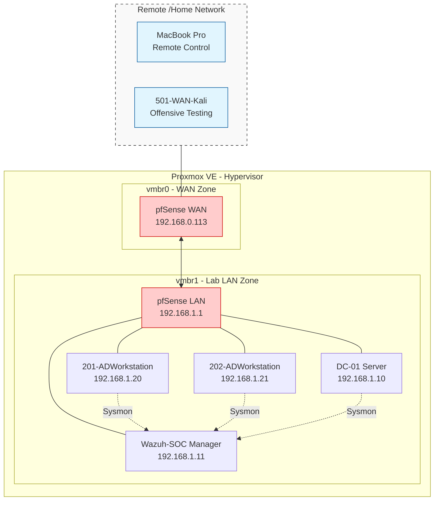

## Description And Project History

This project was developed with strong purpose and focus to learn Cybersecurity, IAM and network mechanisms in practice. The main objective was to create safe and isolated home subnet run fully virtually using dedicated unit equipped with Proxmox bare-metal hypervisor.

> [!NOTE]
>		Project objective was to create safe, monitored infrastructure based on Active Directory and SIEM (Wazuh) integration, with isolation from home network.

### Main Goals
- Isolation: The Lab uses two virtual bridges (vmbr0, vmbr1). Whole outside communication is filtered by pfSense firewall.
- Identity & Access Management: Central point of management for AD is Windows Server 2022 unit (DC-01), it is used for GPO and authorization inside the domain.
- Monitoring & SOC: Ubuntu Server equipped with Wazuh Manager, centralized point of capturing logs from all virtual machines.

	
>		[!NOTE] 
>		The laboratory subnet include technical debt. In production environment, there should be separate network subnet dedicated for security monitoring purposes, although, I decided to leave this issue because of possible Wazuh agents setup corruption and other significant problems.

### IP Addressing

| VMachine          | IP Address       | System              | Role                             |
| ----------------- | ---------------- | ------------------- | -------------------------------- |
| pfSense           | 192.168.1.1     | FreeBSD             | Firewall / Gateway               |
| DC-01             | 192.168.1.10     | Windows Server 2022 | AD/DNS/GPO                       |
| Wazuh-SOC         | 192.168.1.11     | Ubuntu 22.04        | SIEM / Manager                   |
| 201-ADWorkstation | 192.168.1.20     | Windows Server 2022 | Simulating Workstation(endpoint) |
| 202-ADWorkstation | 192.168.1.21     | Windows Server 2022 | Simulating Workstation(endpoint) |
| 501-WAN-Kali      | DHCP 192.168.0.x | Kali Linux 2025.04  | Attacks Simulation               |

# Network Schema

