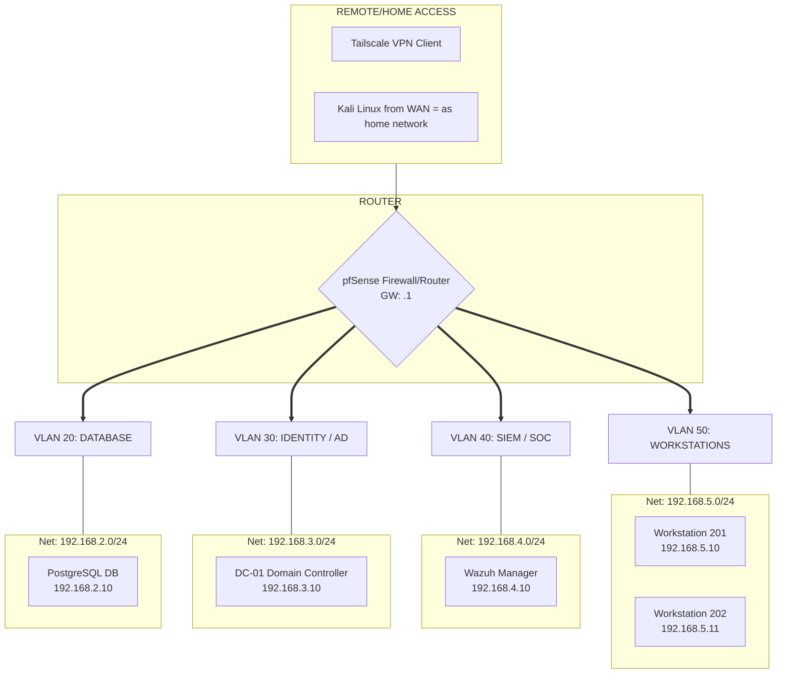

## Essentials

> [!NOTE]
This project was developed with strong purpose and focus to learn Cybersecurity, Networks and infrastructure management in practice. The main objective was to create safe and isolated network simulating enterprise environment run fully virtually using dedicated unit equipped with Proxmox bare-metal hypervisor.

### IP Addressing

### WAN

| VMachine     | IP Address       | System             | Role                                                                      |
| ------------ | ---------------- | ------------------ | ------------------------------------------------------------------------- |
| 501-WAN-Kali | DHCP 192.168.0.x | Kali Linux 2025.04 | Attacks Simulation from WAN(home network should be interpreted as my WAN) |

### LAN / VLAN

| VMachine          | VLAN TAG | IP Address   | System              | Role                                      |     |
| ----------------- | -------- | ------------ | ------------------- | ----------------------------------------- | --- |
| pfSense           | ----     | 192.168.1.1  | FreeBSD             | Firewall / Gateway                        |     |
| DC-01             | 30       | 192.168.3.10 | Windows Server 2022 | AD/DNS/GPO                                |     |
| Wazuh-SOC         | 40       | 192.168.4.10 | Ubuntu Server 22.04 | SIEM / Manager                            |     |
| 201-ADWorkstation | 50       | 192.168.5.10 | Windows Server 2022 | Simulating Workstation(endpoint)          |     |
| 202-ADWorkstation | 50       | 192.168.5.11 | Windows Server 2022 | Simulating Workstation(endpoint)          |     |
| 2001-db-host      | 20       | 192.168.2.10 | Ubuntu Server 22.4  | Database Host Machine, Docker, PostgreSQL |     |

# Network Schema

